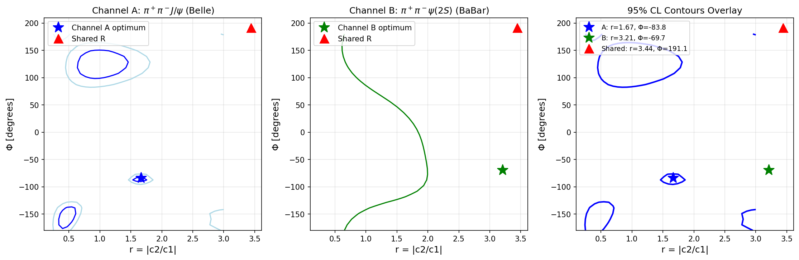

# Y-state Rank-1 Bottleneck Test Report

## Data Sources

| Channel | Reaction | Experiment | HEPData Record | DOI |
|---------|----------|------------|----------------|-----|
| A | e+e- -> pi+pi- J/psi | Belle | ins1225975 | 10.17182/hepdata.61431.v1/t1 |
| B | e+e- -> pi+pi- psi(2S) | BaBar | ins729388 | 10.17182/hepdata.19344.v1/t1 |

## Resonance Parameters (Fixed)

- Y(4220): M = 4.222 GeV, Gamma = 0.044 GeV
- Y(4360): M = 4.368 GeV, Gamma = 0.096 GeV

## Model

Coherent amplitude: A(E) = c1*BW(Y1) + c2*exp(i*phi)*BW(Y2) + background

Background: Complex constant + linear term (bg_order = 1)

## Unconstrained Fit Results

| Channel | r = |c2/c1| | Phi [deg] | chi2/dof | NLL |
|---------|------------|-----------|----------|-----|
| A | 1.667 | -83.8 | 0.632 | 21.80 |
| B | 3.211 | -69.7 | 0.145 | 2.03 |

## Constrained Fit (Shared R)

- R_shared = 3.444 * exp(i * 191.1 deg)
- NLL_constrained = 23.99
- NLL_unconstrained = 23.83

## Statistical Test

- Lambda = 2*(NLL_con - NLL_unc) = 0.3153
- Bootstrap p-value = 0.4000 (500 valid replicates)

## Fit Health

- Channel A chi2/dof = 0.632 (PASS)
- Channel B chi2/dof = 0.145 (PASS)

## Profile Likelihood

- Shared R within Channel A 95% CL: YES
- Shared R within Channel B 95% CL: YES

## Verdict

**SUPPORTED**

Reason: p=0.400 > 0.05 and shared R within both 95% regions

## Plots

