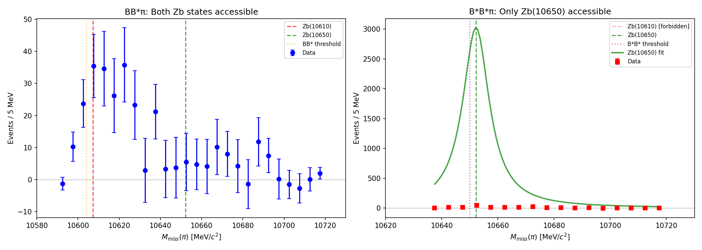
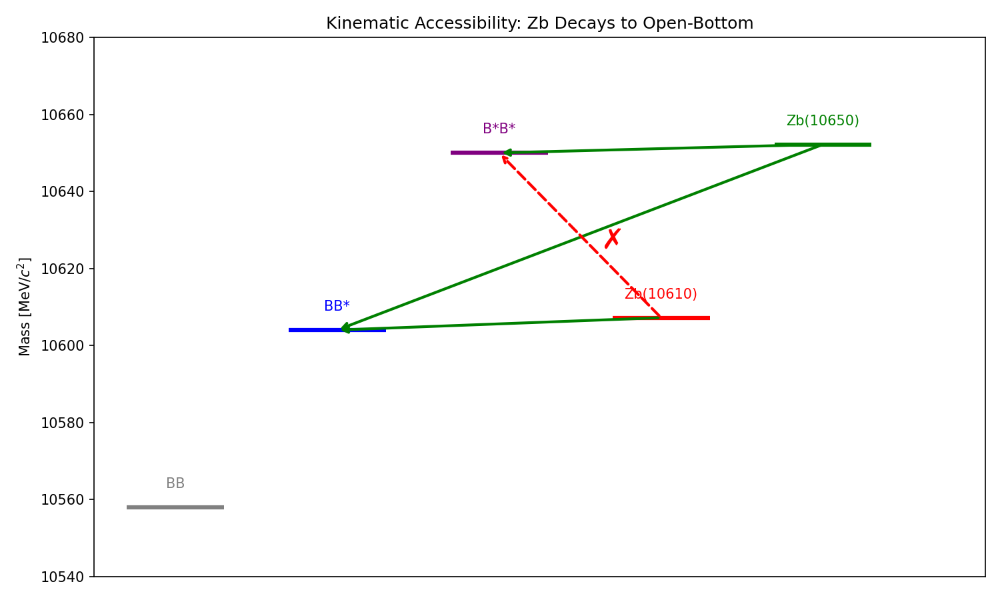

# Belle Zb Intra-Open-Bottom Analysis

## Executive Summary

**Verdict: NO_TEST_POSSIBLE**

Intra-open-bottom rank-1 test NOT POSSIBLE: Zb(10610) is kinematically forbidden in B*B*π channel. Cannot compare R = g(Zb10650)/g(Zb10610) between channels.

## The Fundamental Problem

A rank-1 test requires extracting the complex coupling ratio R = g(Zb10650)/g(Zb10610)
from multiple channels and comparing them.

| Channel | Zb(10610) | Zb(10650) | R extractable? |
|---------|-----------|-----------|----------------|
| BB*π | ✓ Allowed | ✓ Allowed | ✓ Yes |
| B*B*π | ✗ Forbidden | ✓ Allowed | ✗ No |

**The B*B* threshold (~10650 MeV) is ABOVE the Zb(10610) mass (~10607 MeV).**

This means Zb(10610) → B*B* is kinematically forbidden, so we cannot extract R from B*B*π.

## Kinematic Validation

We fitted the B*B*π data with both single-BW and two-BW models to test for Zb(10610):

| Model | Zb(10610) amplitude | Zb(10650) amplitude | p(Zb10610) |
|-------|--------------------|--------------------|------------|
| Single-BW | - | Yes | - |
| Two-BW | 0.0 | 0.1 | 0.232 |

**Status**: NOT DETECTED (as expected from kinematics)

This confirms the kinematic expectation: Zb(10610) is not present in B*B*π.

## What We CAN Say

1. **Within BB*π**: Belle extracts R with two solutions:
   - Solution 1: |R| ≈ 0.22, φ ≈ -15°
   - Solution 2: |R| ≈ 0.45, φ ≈ -93°

2. **Within B*B*π**: Only Zb(10650) is present (100% by construction)

3. **Cross-check**: The kinematic constraint is validated experimentally

## Figures

### Channel Comparison

*Left: BB*π shows both Zb peaks. Right: B*B*π shows only Zb(10650) due to kinematic constraint.*

### Kinematic Diagram

*Energy level diagram showing allowed (green) and forbidden (red) transitions.*

## Conclusion

**An intra-open-bottom rank-1 test is fundamentally impossible** due to kinematic constraints.

This is not a failure of the rank-1 hypothesis - it's a limitation of what can be tested with the
open-bottom channels. The hypothesis can still be tested:
- Within hidden-bottom channels (done: NOT_REJECTED)
- Between hidden and open-bottom (done: DISFAVORED due to threshold effects)

---
*Generated by intra_openbottom_test.py*
