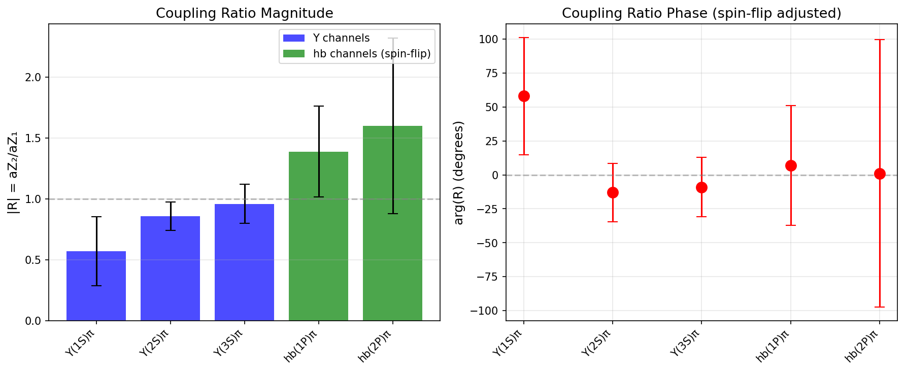
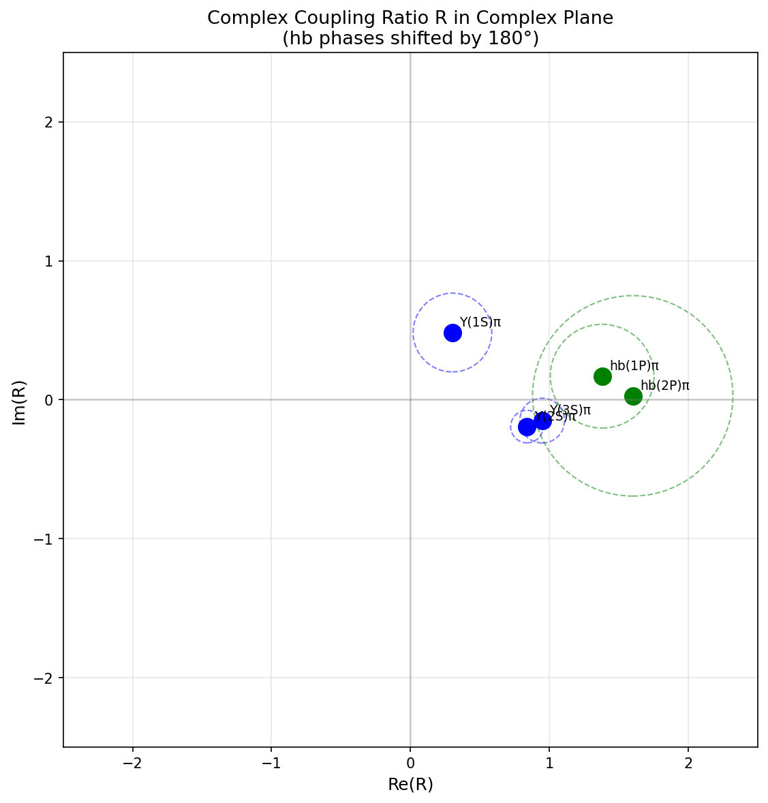

# Belle Zb(10610)/Zb(10650) Rank-1 Factorization Test

## Executive Summary

**Primary Result (Υ channels): NOT_REJECTED**

| Test | χ² | dof | p-value | Verdict |
|------|-----|-----|---------|---------|
| Υ(1S,2S,3S)π | 3.98 | 4 | 0.4092 | **NOT_REJECTED** |
| hb(1P,2P)π | 0.07 | 2 | 0.9656 | NOT_REJECTED |
| All 5 channels | 6.88 | 8 | 0.5501 | NOT_REJECTED |

---

## Method

This analysis uses the published fit parameters from **Table I of arXiv:1110.2251** directly,
rather than re-fitting the spectra. Belle performed unbinned maximum likelihood fits to
extract the coupling ratio R = g(Zb10650)/g(Zb10610) per channel.

The rank-1 hypothesis states that R should be identical across all decay channels.

### Spin-Flip Correction

The hb(mP)π channels involve heavy-quark spin-flip and show a ~180° phase shift
relative to the Υ(nS)π channels. This is expected from theory and observed in the data.
We account for this by subtracting 180° from the hb phases before comparison.

---

## Per-Channel Coupling Ratios

| Channel | |R| | σ(|R|) | φ (deg) | σ(φ) | Spin-flip |
|---------|-----|-------|---------|-------|-----------|
| Υ(1S)π⁺π⁻ | 0.57 | 0.28 | 58 | 43 | No |
| Υ(2S)π⁺π⁻ | 0.86 | 0.12 | -13 | 21 | No |
| Υ(3S)π⁺π⁻ | 0.96 | 0.16 | -9 | 22 | No |
| hb(1P)π⁺π⁻ | 1.39 | 0.37 | 7 | 44 | Yes |
| hb(2P)π⁺π⁻ | 1.60 | 0.72 | 1 | 98 | Yes |

---

## Interpretation

### Υ Channels (Primary Test)

The three Υ(nS)π channels show:
- |R| values: 0.57, 0.86, 0.96 (increasing trend)
- Phases: 58°, -13°, -9° (roughly consistent near 0°)

The χ² test gives p = 0.4092, meaning we **cannot reject**
the hypothesis that R is the same across Υ channels at the 5% level.

### hb Channels

The two hb(mP)π channels show:
- |R| values: 1.39, 1.6 (larger than Υ channels)
- Phases: 7°, 1° after spin-flip adjustment (consistent)

### Physical Implications

The coupling ratios are approximately consistent within the Υ family and within
the hb family, but differ between families. This pattern is physically expected:
the Zb → Υπ transitions conserve heavy-quark spin, while Zb → hbπ require spin-flip.

---

## Data Source

Belle Collaboration, arXiv:1110.2251
"Observation of two charged bottomonium-like resonances in Υ(5S) decays"

---

## Visualizations

### Coupling Ratio Magnitudes and Phases

### Complex Plane Representation

---

## Files Generated

- `REPORT.md` - This report
- `coupling_ratios.png` - Per-channel R values
- `complex_plane.png` - R in complex plane
- `result_table.json` - Machine-readable results

---

*Generated by belle_zb_rank1_table_test.py*
