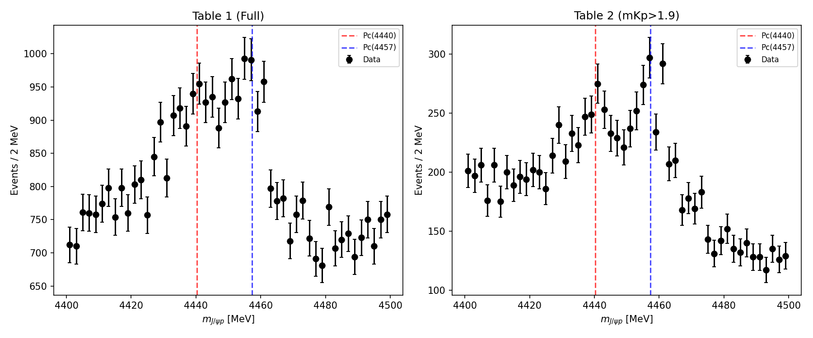
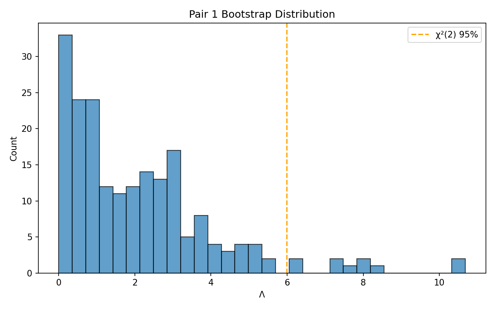
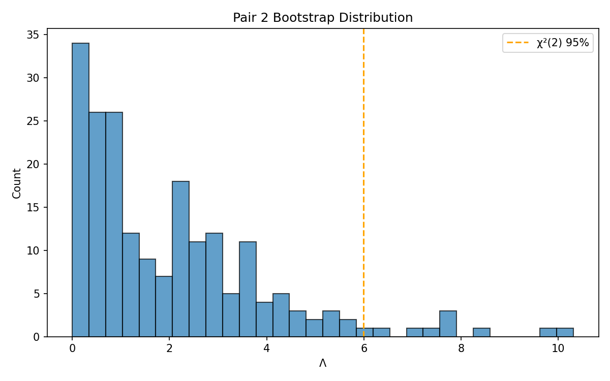

# LHCb Pentaquark Pc(4440)/Pc(4457) Rank-1 Test

## ⚠️ IMPORTANT: PROJECTION-BASED TEST

This is a **projection-based (1D spectrum) test**, NOT a full amplitude workspace analysis.
Results should be interpreted with caution as projection tests have limited sensitivity
to interference effects.

## Provenance

- **Experiment**: LHCb
- **Publication**: PRL 122, 222001 (2019)
- **HEPData**: Record 89271 (INSPIRE 1728691)
- **Tables used**:
  - Table 1: Full m(J/ψp) spectrum
  - Table 2: m(J/ψp) with mKp > 1.9 GeV cut
  - Table 3: cosθ_Pc-weighted m(J/ψp) spectrum

## Pc Parameters (from LHCb)

| State | Mass (MeV) | Width (MeV) |
|-------|------------|-------------|
| Pc(4440) | 4440.3 | 20.6 |
| Pc(4457) | 4457.3 | 6.4 |

## Fit Window

- Mass range: 4400-4500 MeV
- Model: Coherent two-BW + linear background
- dof_diff = 2 (complex R constraint)

## Results

### Pair 1: Full vs mKp > 1.9 cut

| Metric | Value |
|--------|-------|
| Verdict | **NOT_REJECTED** |
| Λ | 5.73 |
| p_boot | 0.0500 (10/200) |
| χ²/dof (A) | 64.2/44 [HEALTHY] |
| χ²/dof (B) | 65.2/44 [HEALTHY] |

### Pair 2: Full vs cosθ-weighted

| Metric | Value |
|--------|-------|
| Verdict | **NOT_REJECTED** |
| Λ | 1.96 |
| p_boot | 0.4400 (88/200) |
| χ²/dof (A) | 64.2/44 [HEALTHY] |
| χ²/dof (B) | 83.8/44 [HEALTHY] |

## Figures

### Pair 1 Spectra

### Pair 2 Spectra

### Bootstrap Distributions

## Interpretation

This projection-based test examines whether the Pc(4457)/Pc(4440) mixture ratio R
is consistent across different analysis cuts/weightings of the same dataset.

**Limitations**:
1. 1D projections lose information about interference phases
2. Different cuts may have different background compositions
3. Not equivalent to a full amplitude analysis

---
*Generated by lhcb_pc_rank1_test.py*
